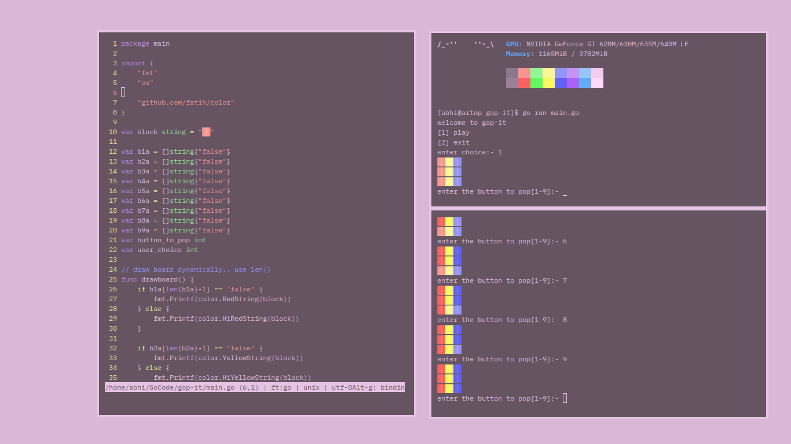

# gop-it
A command line pop it game in go

# features

- [x] dynamic board gen
- [x] use ansi colors

# todo

- [ ] main menu

# requirements

- terminal having 16 colors 
- go 1.20
- posix shell(see )

# install

```
git clone https://github.com/sontaimnt/gop-it
cd gop-it
go mod download
go build
./gop-it
```

# preview


